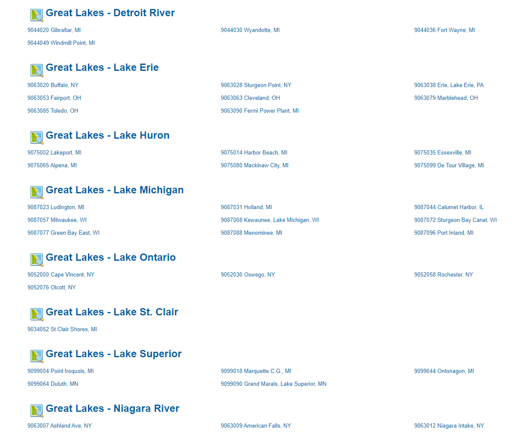
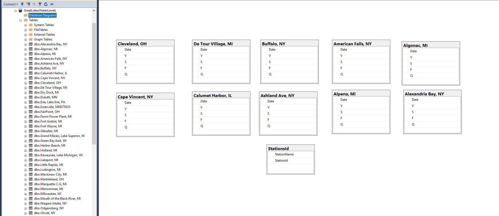

# Great_Lakes_Water_Tracker
An application to record, analyse, and visualise Great Lakes water levels. 

 

## API PULLS
This folder contains 3 files nessesary for daily data pulls. The info_pull.py file contains most logic to format NOAA API requests. This file relies on the stations.json file which contains every great lakes StationId and Location. The Id is used within the API request to pull the corresponding Stations data. This information is found here. [NOAAStationIds](https://tidesandcurrents.noaa.gov/stations.html)

## Database 
The DB folder of the project contains all logic relating to the creation of the local data base. The data being stored is not complex in its structure, meaning data base creation can be handled through stored procedures. All tables including helper tables will be created when pushing data into the database. Each station has its own table with its location as the table name. To see details of the stored information see [info.txt](./DB/info.txt) within the DB folder.

## Prediction Model and Visuals
The Prediction_Model and Visuals folders contain uses for the pulled data. The Visuals folder uses MatPlotLib to create graphs from the exsisting information. The files in these folders pull from the local data base using the [SelectDateRange.sql](./DB/SelectDateRange.sql) stored prodecure. The [Prediction_model](./Prediction_Model/) folder contains a LSTM model designed to predict the next days water level. The CSV contains historic data for taining the model and [LSTM_model.py](./Prediction_Model/LSTM_model.py) contains the model itself. 
